<p align="center">
  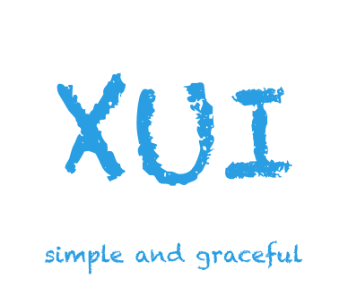
</p>

# XUI
[](https://jitpack.io/#xuexiangjys/XUI)
[![api][apisvg]][api]
[](https://github.com/xuexiangjys/XUI/issues)
[](https://github.com/xuexiangjys/XUI)

一个简洁而又优雅的Android原生UI框架，解放你的双手！还不赶紧点击[使用说明文档](https://github.com/xuexiangjys/XUI/wiki)，体验一下吧！

> 涵盖绝大部分的UI组件：TextView、Button、EditText、ImageView、Spinner、Picker、Dialog、PopupWindow、ProgressBar、LoadingView、StateLayout、FlowLayout、Switch、Actionbar、TabBar、Banner、GuideView、BadgeView、MarqueeView、WebView、SearchView等一系列的组件和丰富多彩的样式主题。

在提issue前，请先阅读[【提问的智慧】](https://xuexiangjys.blog.csdn.net/article/details/83344235)，并严格按照[issue模板](https://github.com/xuexiangjys/XUI/issues/new/choose)进行填写，节约大家的时间。

## 关于我

[](https://github.com/xuexiangjys)   [](http://blog.csdn.net/xuexiangjys)

----

## 特征

* 简洁优雅，尽可能少得引用资源文件的数量，项目库整体大小不足1M(打包后大约644k）
* 组件丰富，提供了绝大多数我们在开发者常用的功能组件。
* 使用简单，为方便快速开发，提高开发效率，对api进行了优化，提供一键式接入。
* 样式统一，框架提供了一系列统一的样式，使UI整体看上去美观和谐。
* 兼容性高，框架还提供了3种不同尺寸设备的样式（4.5英寸、7英寸和10英寸），并且最低兼容到Android 17, 让UI兼容性更强。
* 扩展性强，各组件提供了丰富的属性和样式API，可以通过设置不同的样式属性，构建不同风格的UI。

----

## 如何使用

> 在决定使用XUI前，你必须明确的一点是，此框架给出的是一整套UI的整体解决方案，如果你只是想使用其中的几个控件，那大可不必引入如此庞大的一个UI库，Github上会有更好的组件库。如果你是想拥有一套可以定制的、统一的UI整体解决方案的话，那么你就继续往下看吧！

### 添加Gradle依赖

1.先在项目根目录的 build.gradle 的 repositories 添加:
```
allprojects {
     repositories {
        ...
        maven { url "https://jitpack.io" }
    }
}
```

2.然后在dependencies添加:

```
dependencies {
  ...
  //1.0.5版本后只支持androidx
  implementation 'com.github.xuexiangjys:XUI:1.0.6'

  implementation 'androidx.appcompat:appcompat:1.0.2'
  implementation 'androidx.recyclerview:recyclerview:1.0.0'
  implementation 'com.google.android.material:material:1.1.0-alpha07'
  implementation 'com.github.bumptech.glide:glide:4.8.0'
}
```

【注意】如果你的项目目前还未使用androidx，那你只能使用1.0.5之前的版本了。

```
dependencies {
  ...
  implementation 'com.github.xuexiangjys:XUI:1.0.4'

  implementation 'com.android.support:appcompat-v7:28.0.0'
  implementation 'com.android.support:recyclerview-v7:28.0.0'
  implementation 'com.android.support:design:28.0.0'
  implementation 'com.github.bumptech.glide:glide:4.8.0'
}
```

### 初始化XUI设置

1.在Application最顶部初始化设置

```
XUI.init(this); //初始化UI框架
XUI.debug(true);  //开启UI框架调试日志

```

2.调整应用的基础主题

> 必须设置应用的基础主题，否则组件将无法正常使用！

基础主题类型：

* 大平板(10英寸, 240dpi, 1920*1200）：XUITheme.Tablet.Big

* 小平板(7英寸, 320dpi, 1920*1200）：XUITheme.Tablet.Small

* 手机（4.5英寸, 320dpi, 720*1280）：XUITheme.Phone

```
<style name="AppTheme" parent="XUITheme.Phone">

    <!-- 自定义自己的主题样式 -->

    <item name="colorPrimary">@color/colorPrimary</item>
    <item name="colorPrimaryDark">@color/colorPrimaryDark</item>
    <item name="colorAccent">@color/colorAccent</item>

</style>

```
当然也可以在Activity刚开始时调用如下代码动态设置主题

```
@Override
protected void onCreate(Bundle savedInstanceState) {
    XUI.initTheme(this);
    super.onCreate(savedInstanceState);
    ...
}
```

3.调整字体库（对字体无要求的可省略）

（1）设置你需要修改的字体库路径（assets下）
```
//设置默认字体为华文行楷，这里写你的字体库
XUI.getInstance().initFontStyle("fonts/hwxk.ttf");
```

（2）在项目的基础Activity中加入如下代码注入字体.

```
@Override
protected void attachBaseContext(Context newBase) {
    //注入字体
    super.attachBaseContext(CalligraphyContextWrapper.wrap(newBase));
}
```

----

## 演示（请star支持）

### 演示程序截图

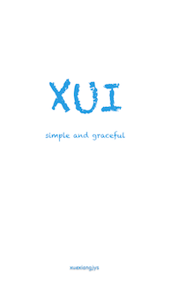 &emsp; 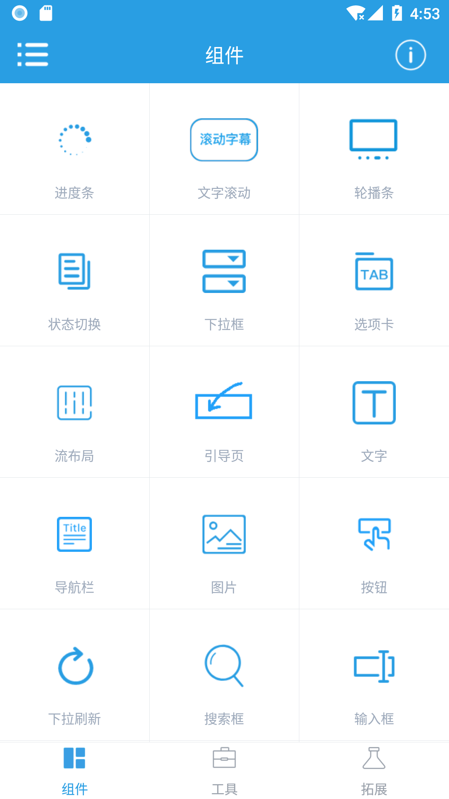 &emsp; 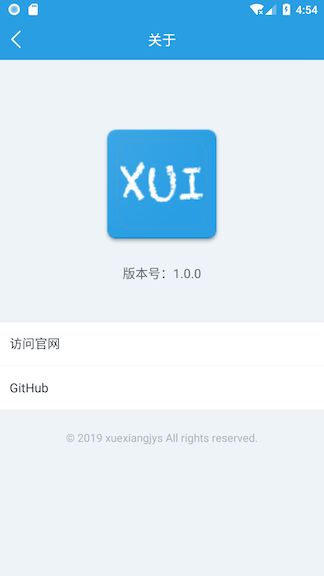 &emsp; 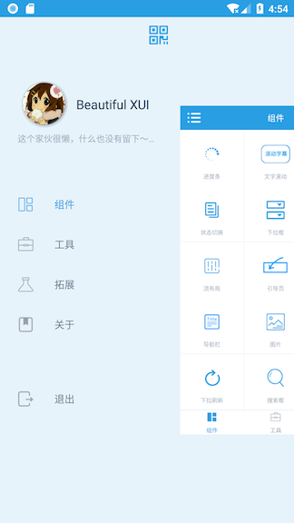

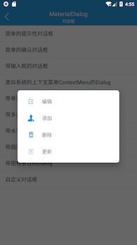 &emsp; 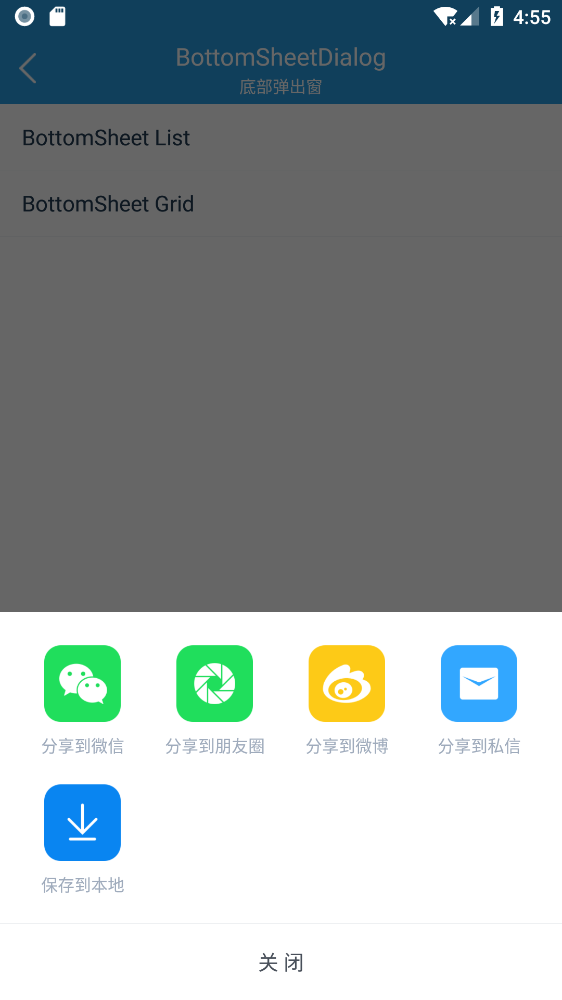 &emsp; 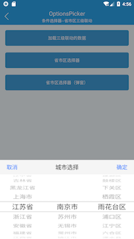 &emsp; 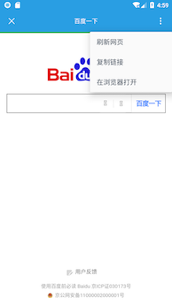

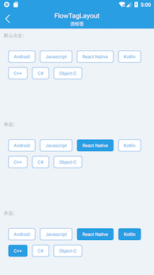 &emsp; 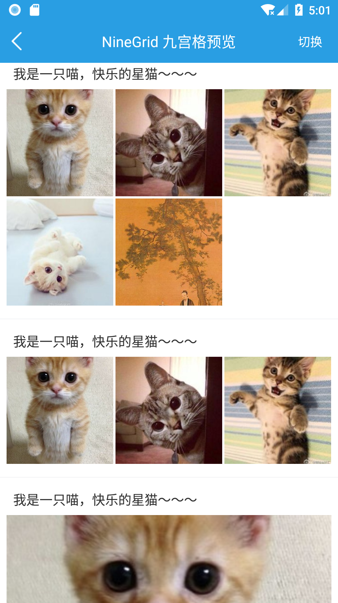 &emsp; 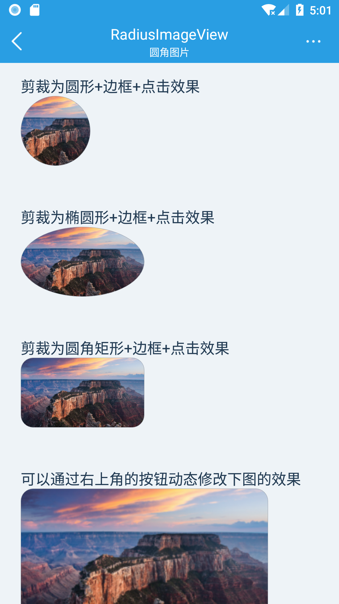 &emsp; 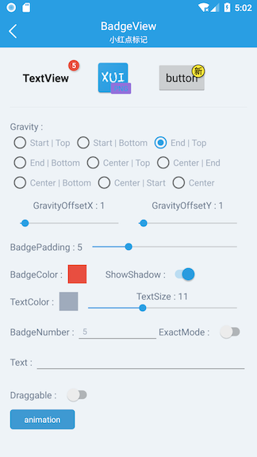

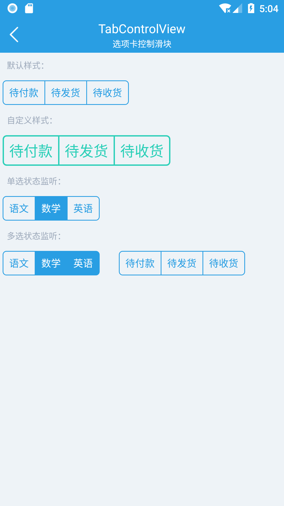 &emsp; 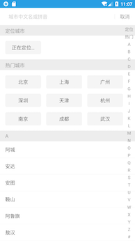 &emsp; 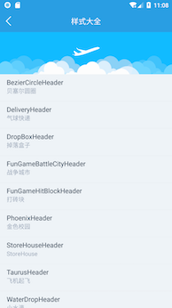 &emsp; 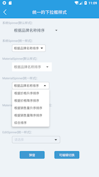 &emsp;

### Demo下载

> 演示程序大概18M（主要是demo中集成了一个小视频拍摄的库比较大，大约13M左右，而XUI库目前只有644k大小），项目比较大，推荐使用蒲公英下载。

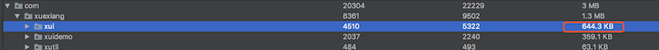

#### 蒲公英下载

[](https://www.pgyer.com/XUIDemo)


#### Github下载

[](https://github.com/xuexiangjys/XUI/blob/master/apk/xuidemo.apk?raw=true)


## 特别感谢

* [QMUI_Android](https://github.com/Tencent/QMUI_Android)
* [AgentWeb](https://github.com/Justson/AgentWeb)
* [CityPicker](https://github.com/xuexiangjys/CityPicker)
* [SmartRefreshLayout](https://github.com/scwang90/SmartRefreshLayout)
* [PictureSelector](https://github.com/LuckSiege/PictureSelector)
* [Android-PickerView](https://github.com/Bigkoo/Android-PickerView)
* [MaterialEditText](https://github.com/rengwuxian/MaterialEditText)
* [MaterialSpinner](https://github.com/jaredrummler/MaterialSpinner)
* [FlycoBanner_Master](https://github.com/H07000223/FlycoBanner_Master)
* [MaterialProgressBar](https://github.com/DreaminginCodeZH/MaterialProgressBar)

## 如果觉得项目还不错，可以考虑打赏一波

 &emsp; 

## 联系方式

[](http://shang.qq.com/wpa/qunwpa?idkey=9922861ef85c19f1575aecea0e8680f60d9386080a97ed310c971ae074998887)


[xuisvg]: https://img.shields.io/badge/XUI-v1.0.6-brightgreen.svg
[xui]: https://github.com/xuexiangjys/XUI
[apisvg]: https://img.shields.io/badge/API-17+-brightgreen.svg
[api]: https://android-arsenal.com/api?level=17